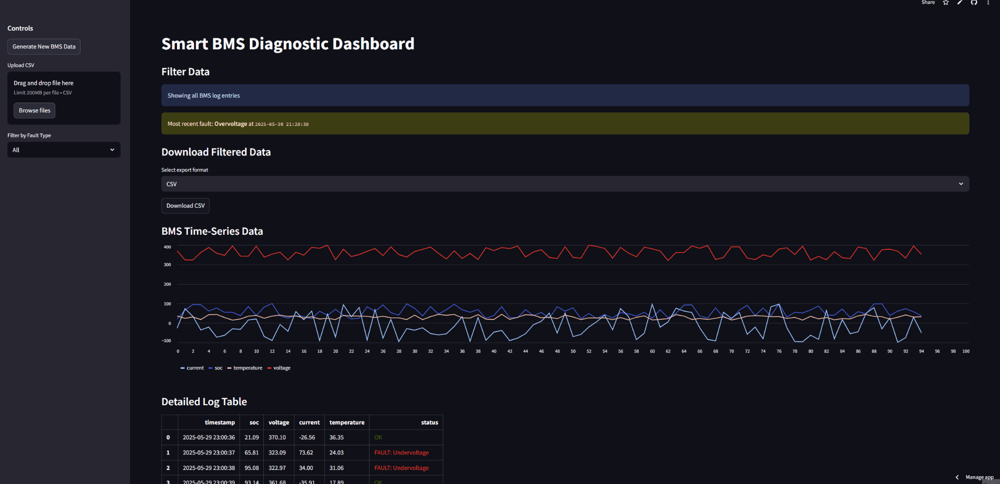

# 🔋 Smart BMS Diagnostic Dashboard

A real-time simulation and diagnostic dashboard for Battery Management Systems (BMS), built with Python and Streamlit. This tool simulates live data, injects faults, and visualizes key system metrics such as SOC, voltage, current, and temperature — all in an interactive web UI.

## ⚙️ Features

- Simulated real-time BMS log generation
- Fault injection engine with multiple fault types
- Interactive dashboard using Streamlit
- Live filtering by fault type
- Summary of fault counts
- Upload your own BMS CSV logs

## 🌐 Live Demo

👉 [View the Dashboard on Streamlit Cloud](https://smart-bms-dashboard.streamlit.app/)

## 🖥️ Demo



## 🚀 How to Run Locally

```bash
git clone https://github.com/sergiohernandezjaimes/smart-bms-diagnostic.git
cd smart-bms-diagnostic
pip install -r requirements.txt
streamlit run dashboard.py

## 📦 Tech Stack

- Python
- Streamlit
- Pandas
- Matplotlib

## ✍️ Author

**Sergio Hernandez**  
GitHub: [@sergiohernandezjaimes](https://github.com/sergiohernandezjaimes.com/)
LinkedIn: [LinkedIn Profile](https://www.linkedin.com/in/sergio-hernandez-1948b0159.com/)
